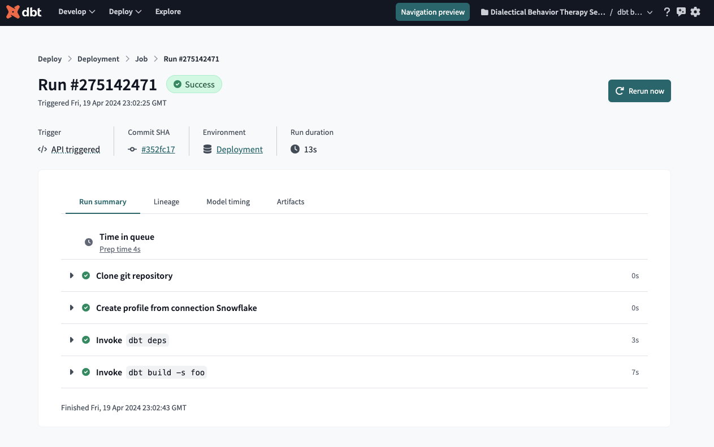

### Airflow

An quick example of using Airflow with dbt Cloud.

```sh
git clone https://github.com/jeremyyeo/dbt-sandcastles.git
cd dbt-sandcastles/airflow/

# Setup python virtual env and install Airflow with the dbt Cloud provider.
python -m venv venv
source venv/bin/activate
pip install --upgrade pip
pip install "apache-airflow==2.9.0" "apache-airflow-providers-dbt-cloud[http]==3.7.1"

# Set Airflow configurations.
export AIRFLOW_HOME="$(pwd)"  # Sets the Airflow home directory.
export AIRFLOW__CORE__DAGS_FOLDER="$(pwd)/dags" # Tell Airflow that our dags/tasks are in /dags folder.
export AIRFLOW__CORE__LOAD_EXAMPLES=false # Don't load all the example dags that come with Airflow.
airflow db migrate
```

Test if Airflow is working:

```sh
$ airflow tasks test sample echo -t '{"what": "Hello World"}'
...
[2024-04-20T11:19:05.469+1200] {subprocess.py:75} INFO - Running command: ['/bin/bash', '-c', "echo 'Hello World'"]
[2024-04-20T11:19:05.480+1200] {subprocess.py:86} INFO - Output:
[2024-04-20T11:19:05.491+1200] {subprocess.py:93} INFO - Hello World
[2024-04-20T11:19:05.491+1200] {subprocess.py:97} INFO - Command exited with return code 0
...
```

Export your dbt Cloud connection so that Airflow can read that via an env var (see [docs](https://airflow.apache.org/docs/apache-airflow-providers-dbt-cloud/stable/connections.html) for more), then trigger a dbt Cloud job run by testing the task - here we're passing in a dbt Cloud job ID via the setting the task params (see [docs](https://airflow.apache.org/docs/apache-airflow/stable/cli-and-env-variables-ref.html#test_repeat2) for more):

```sh
$ export AIRFLOW_CONN_DBT_CLOUD_DEFAULT='dbt-cloud://<account_id>:<dbt_cloud_api_key>@'
$ airflow tasks test dbt_cloud run_job -t '{"job_id": 556993}'

[2024-04-20T11:02:23.240+1200] {dagbag.py:540} INFO - Filling up the DagBag from /Users/jeremy/src/dbt-sandcastles/airflow/dags
[2024-04-20T11:02:23.588+1200] {taskinstance.py:2073} INFO - Dependencies all met for dep_context=non-requeueable deps ti=<TaskInstance: dbt_cloud.run_job __airflow_temporary_run_2024-04-19T23:02:23.546945+00:00__ [None]>
[2024-04-20T11:02:23.598+1200] {taskinstance.py:2073} INFO - Dependencies all met for dep_context=requeueable deps ti=<TaskInstance: dbt_cloud.run_job __airflow_temporary_run_2024-04-19T23:02:23.546945+00:00__ [None]>
[2024-04-20T11:02:23.599+1200] {taskinstance.py:2303} INFO - Starting attempt 1 of 1
[2024-04-20T11:02:23.600+1200] {taskinstance.py:2385} WARNING - cannot record queued_duration for task run_job because previous state change time has not been saved
[2024-04-20T11:02:23.601+1200] {taskinstance.py:2327} INFO - Executing <Task(DbtCloudRunJobOperator): run_job> on 2024-04-19 23:02:23.546905+00:00
[2024-04-20T11:02:23.653+1200] {taskinstance.py:2644} INFO - Exporting env vars: AIRFLOW_CTX_DAG_OWNER='airflow' AIRFLOW_CTX_DAG_ID='dbt_cloud' AIRFLOW_CTX_TASK_ID='run_job' AIRFLOW_CTX_EXECUTION_DATE='2024-04-19T23:02:23.546905+00:00' AIRFLOW_CTX_TRY_NUMBER='1' AIRFLOW_CTX_DAG_RUN_ID='__airflow_temporary_run_2024-04-19T23:02:23.546945+00:00__'
[2024-04-20T11:02:23.657+1200] {taskinstance.py:430} INFO - ::endgroup::
[2024-04-20T11:02:23.686+1200] {crypto.py:82} WARNING - empty cryptography key - values will not be stored encrypted.
[2024-04-20T11:02:23.687+1200] {connection.py:274} WARNING - Connection schemes (type: dbt_cloud) shall not contain '_' according to RFC3986.
[2024-04-20T11:02:23.688+1200] {base.py:84} INFO - Using connection ID 'dbt_cloud_default' for task execution.
[2024-04-20T11:02:24.983+1200] {dbt.py:164} INFO - Waiting for job run 275142471 to terminate.
[2024-04-20T11:02:24.984+1200] {dbt.py:504} INFO - Getting the status of job run 275142471.
[2024-04-20T11:02:25.895+1200] {dbt.py:509} INFO - Current status of job run 275142471: STARTING
[2024-04-20T11:02:35.898+1200] {dbt.py:504} INFO - Getting the status of job run 275142471.
[2024-04-20T11:02:36.816+1200] {dbt.py:509} INFO - Current status of job run 275142471: RUNNING
[2024-04-20T11:02:46.824+1200] {dbt.py:504} INFO - Getting the status of job run 275142471.
[2024-04-20T11:02:47.727+1200] {dbt.py:509} INFO - Current status of job run 275142471: SUCCESS
[2024-04-20T11:02:47.729+1200] {dbt.py:173} INFO - Job run 275142471 has completed successfully.
[2024-04-20T11:02:47.731+1200] {taskinstance.py:441} INFO - ::group::Post task execution logs
[2024-04-20T11:02:47.745+1200] {taskinstance.py:1205} INFO - Marking task as SUCCESS. dag_id=dbt_cloud, task_id=run_job, execution_date=20240419T230223, start_date=, end_date=20240419T230247
```


