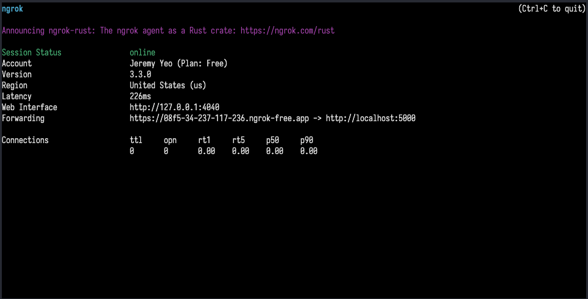
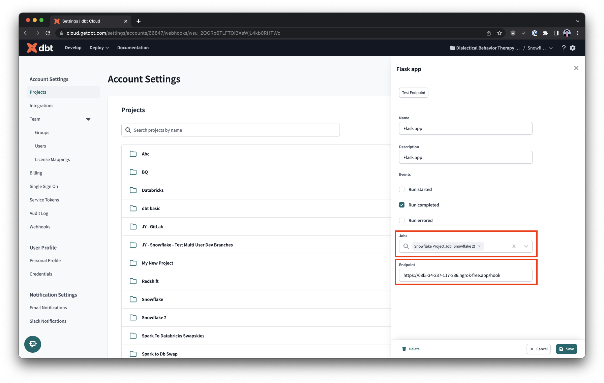

## Validating dbt Cloud webhooks

A quick sample using Flask to [validate dbt Cloud webhooks](https://docs.getdbt.com/docs/deploy/webhooks#validate-a-webhook).

Note: We'll be using [ngrok](https://ngrok.com/) so that we can expose our locally running Flask app to the web.

Video: https://www.loom.com/share/a6b7a7d9e40b4bcb9dbf2807ebb6aaf5

## Prerequisite

You'll want to create a dbt Cloud webhook already and save the Webhook secret key somewhere. We will comeback to this webhook later and updated it to point to the ngrok public endpoint.

## Steps

1. Install ngrok.

```sh
brew install --cask ngrok
```

> We're using brew to install it on macOS but your instructions may vary depending on OS.

2. Install Flask into a virtual env.

```sh
python -m venv venv
source venv/bin/activate
pip install --upgrade pip
pip install Flask==2.3.2
```

3. Export the webhook secret key to an env var and then run our Flask app.

```sh
export WEBHOOK_KEY=<key-from-prerequisite>
python main.py
```

```sh
# output
 * Serving Flask app 'main'
 * Debug mode: off
WARNING: This is a development server. Do not use it in a production deployment. Use a production WSGI server instead.
 * Running on http://127.0.0.1:5000
```

At this time, the Flask app should be running and you can check that things are working by opening the browser to the localhost URL - most likely `http://127.0.0.1:5000` or doing `curl http://localhost:5000` from your shell.

```sh
$ curl http://localhost:5000
{"status": "hello"}
```

4. Tunnel to your local port 5000 (default Flask app port).

```sh
ngrok http 5000
```

This will start ngrok and return a forwarding url / public endpoint - it will look something like this:



We can test that forwarding is working by doing curl like before - but to the forwarding url:

```sh
$ curl https://08f5-34-237-117-236.ngrok-free.app
{"status": "hello"}
```

5. Using the ngrok forwarding URL above, go back to the dbt Cloud webhook and change the "Endpoint" accordingly.



Because the Flask app is responding to POST requests on the `/hook` path - we've added `/hook` to the end of the ngrok forwarding url.

You'll also want to double check which jobs will be using the webhook - here, we've just defined a single arbitrary dbt Cloud job to trigger the webhook when the run completes successfully.

6. Now that we've got everything setup - let's run our dbt Cloud job and watch the console for when the Flask app prints out the various values.

```sh
# output
Received auth headers:
b9ca84306d58afd3d782094459d2eec9bb7309bf35f6cf1ebe3cfe26f1ee7e24
b'{"accountId":66847,"eventId":"wev_2QSUzWMSv40ow7s8n8TfVPVnYua","timestamp":"2023-05-29T07:52:18.06660617Z","eventType":"job.run.completed","webhookId":"wsu_2QGRb6TLFTOlBXsWjL4kb0RHTWc","webhookName":"Flask app","data":{"jobId":"278164","jobName":"Snowflake Project Job","runId":"155144666","environmentId":"187998","environmentName":"Deployment 1.4","dbtVersion":"1.4.6","projectName":"Snowflake 2","projectId":"241251","runStatus":"Success","runStatusCode":10,"runStatusMessage":"None","runReason":"Kicked off from UI by jeremy.yeo@dbtlabs.com","runStartedAt":"2023-05-29T07:51:56Z","runFinishedAt":"2023-05-29T07:52:15Z"}}'
Signature generated with request body:
b9ca84306d58afd3d782094459d2eec9bb7309bf35f6cf1ebe3cfe26f1ee7e24
Is request valid:
True
127.0.0.1 - - [29/May/2023 19:52:43] "POST /hook HTTP/1.1" 200 -
```

As we can see from the above output - the authorization value in the header matches with the signature we generated using the request body with the webhook secret key.
